# APPLYING DAUBERT STANDARD FOR FORENSIC EVIDENCE

## Suspect:
**Beverly Gates, HR Manager**

## Company (Victim):
**Intricate Solutions, Inc**
==========================================================
# Executive Summary

In this digital forensic investigation, a drive image labeled **Evidence_drive1.001** was analyzed, suspected to contain incriminating evidence related to a drug trafficking case. The drive was seized from the suspect's system during an operation targeting a drug trafficking ring. The purpose of the investigation was to extract relevant evidence from the drive, validate the integrity of the data, and ensure that no tampering had occurred during the handling of the digital evidence.

Using industry-standard forensic tools, such as **FTK Imager** and **Autopsy**, I focused on extracting and verifying email correspondence, file metadata, and other documents that might indicate the suspect's involvement in illegal activities. A suspicious email file, **Re_Stuff purchase request.eml**, was identified and analyzed as potential evidence. The email was reviewed using hash code verification methods, ensuring that the data had not been altered since the time of its collection.

Verification of hash values, such as **MD5** and **SHA1**, for both the original drive image and the suspicious email revealed that no changes were made during the forensic process. This confirmed the integrity of the evidence. The hash codes were consistent across both **FTK Imager** and **Autopsy** tools, further solidifying the reliability of the extracted data.

Key pieces of evidence uncovered during this analysis, such as email communications and metadata, could play a crucial role in linking the suspect to the trafficking network. The investigation successfully preserved the integrity of the digital evidence, making it ready for presentation in potential court proceedings.


## Case Summary:
Beverly Gates, the HR Manager for Intricate Solutions, Inc., has come under suspicion for involvement in a sophisticated drug trafficking operation. The company’s management reported the suspicions to the Boston Police Department after uncovering potential links between Gates and criminal activity. Due to the serious nature of the accusation, the Boston Police Department assigned Officer Brendan O’Rourke to lead the investigation.

As part of the investigation, Officer O’Rourke sought and obtained a search warrant from the United States District Court for the District of Massachusetts. The warrant authorized the search of a work laptop issued to Beverly Gates by her employer, Intricate Solutions, Inc. The case number assigned to this investigation is **10001-BPD-CCD**.

> **Important Note**: Search warrants impose specific legal boundaries on the collection of evidence. Investigators must remain within these boundaries, as any overstepping may lead to the exclusion of key evidence in court and could jeopardize the entire investigation.

An image of the search warrant can be seen below:
-vWorkstation-1725500025187.jpeg>)
-vWorkstation-1725500120514.jpeg>)
-vWorkstation-1725500131086.jpeg>)
-vWorkstation-1725500146562.jpeg>)
-vWorkstation-1725500160095.jpeg>)
-vWorkstation-1725500167120.jpeg>)

---

## Forensic Examination Process:
Upon the confiscation of Beverly Gates’ work laptop, the next step is to conduct a thorough forensic examination of the device’s hard drive. As a Digital Forensics Specialist working within the **Cyber Crimes Division (CCD)** of the Boston Police Department, I have been tasked with overseeing this crucial phase of the investigation.

The main goal of the forensic examination is to uncover any digital evidence that can confirm or refute the claims against Beverly Gates. This involves identifying whether she used her work laptop in any capacity related to the alleged drug trafficking operation.

---

### Importance of the Chain of Custody:
Upon receiving the laptop from Officer Brendan O’Rourke, the first critical step is to initiate and maintain the **chain of custody**. The chain of custody is the process of documenting the handling, transfer, and storage of evidence from the time it is seized until it is presented in court.

The chain of custody must be meticulously followed, as it directly impacts the admissibility of the evidence. Any break or discrepancy in this process could allow the defense to challenge the integrity of the evidence, potentially rendering it inadmissible. This is especially significant in digital forensics, where data can be easily manipulated if not properly secured.

The chain of custody ensures that:
1. The evidence has not been tampered with.
2. The evidence presented in court is the same as that which was originally collected.
3. All personnel handling the evidence are documented and accountable.

Below is a sample of the chain of custody form for **Case Number 10001-BPD-CCD**:

-vWorkstation-1725501035798.jpeg>)
-vWorkstation-1725501091460.jpeg>)

### Relevance of the Daubert Standard:
The **Daubert Standard** plays an essential role in ensuring that any scientific or expert testimony presented in court meets a high standard of reliability. This standard was established following the 1993 Supreme Court ruling in **Daubert v. Merrell Dow Pharmaceuticals, Inc. (509 U.S. 579)**, which set forth criteria for determining the admissibility of scientific evidence in federal and many state courts.

As the forensic expert handling the evidence in this case, it is my responsibility to ensure that all methodologies and techniques employed during the investigation align with the Daubert Standard. This will help ensure that the digital forensic evidence we collect can be presented in court and withstand any legal scrutiny.

---

### Factors Considered Under the Daubert Standard:
When applying the Daubert Standard, the following factors must be evaluated to determine whether the forensic techniques employed are valid and admissible in court:

1. **Testability of the Technique**:  
   A critical question that must be answered is whether the forensic technique or theory used in the investigation can be tested and verified. Scientific methods that are untestable or speculative may not meet the criteria for admissibility under the Daubert Standard.

2. **Peer Review and Publication**:  
   For a method to be considered valid, it should have been subjected to peer review and publication. This ensures that the technique has been examined by the wider scientific community, providing validation and transparency.

3. **Known or Potential Error Rate**:  
   Another important consideration is the known or potential error rate of the technique. This helps determine the reliability of the results produced by the method. A technique with a high error rate is less likely to be considered reliable.

4. **Standards Controlling the Operation**:  
   The existence of standards and controls governing the operation of the technique is essential to ensure consistency and reliability. Methods that do not adhere to such standards are more prone to producing unreliable results.

5. **General Acceptance in the Scientific Community**:  
   Finally, the technique must have achieved general acceptance within the relevant scientific community. Techniques that are novel or have not been widely adopted by experts in the field are less likely to meet the requirements of the Daubert Standard.

---

### Application of the Daubert Standard in Digital Forensics:
The application of the Daubert Standard is particularly important in digital forensics, where emerging technologies and techniques are constantly evolving. Since the Daubert Standard requires that scientific evidence presented in court be **generally accepted** within the field, it is important for forensic investigators to stay up-to-date with the latest developments and ensure that the tools and methods they use are widely recognized and validated.

For example, techniques such as data recovery, file carving, and keyword searches are widely accepted and have been tested extensively in the field of digital forensics. However, newer tools or methodologies may face challenges in meeting the Daubert criteria if they have not yet undergone peer review or achieved general acceptance.

The Daubert Standard ensures that only scientifically valid and reliable evidence is admitted in court, reducing the chances of errors or miscarriages of justice based on faulty forensic testimony.

---

### Importance of Due Process:
It is crucial to follow **due process** during every phase of the forensic investigation. From receiving the evidence, through the forensic examination, to documenting the findings, each step must be carefully documented. Deviations from due process, such as mishandling evidence or failing to document procedures, could have severe consequences for the investigation, including the dismissal of vital evidence.

Adhering to both the **Daubert Standard** and the chain of custody protocols ensures that the forensic process remains robust, transparent, and legally sound. This diligence is necessary to avoid compromising the integrity of the investigation.

---

In the case of Beverly Gates and her potential involvement in drug trafficking, the forensic examination of her work laptop will be conducted following strict procedures and guidelines. By maintaining the chain of custody and adhering to the Daubert Standard, we ensure that the digital evidence gathered during the investigation can be reliably presented in court.

The outcome of this forensic investigation will play a crucial role in determining the guilt or innocence of Beverly Gates, and as such, the integrity of the process is paramount. Moving forward, the evidence will be carefully analyzed, and any findings will be documented in a manner that upholds the standards of both forensic science and the law.

---

## Carrying Out the Forensics

As the Digital Forensics Specialist at the **Cyber Crimes Division (CCD)** of the Boston Police Department, I will be utilizing three primary forensic analysis tools to determine whether the crime in question was indeed perpetrated by the suspect, Beverly Gates, or if the accusations are baseless. The tools to be used for the investigation are as follows:

1. **FTK Imager**
2. **Autopsy**
3. **Paraben's Electronic Evidence Examiner (E3)**

These forensic tools have been installed on my forensic workstation, which operates on **Microsoft Server 2019 Edition**. The first step in this investigation involves processing the image file of the hard drive from Beverly Gates' work laptop. The image file has already been acquired and securely stored on **Drive C** of the workstation.

### Verifying the Integrity of the Image

To ensure the integrity of the image file and to maintain the chain of custody, I will use **FTK Imager**'s command-line version to generate the hash values (MD5 and SHA-1) of the original hard drive and compare them against the hash of the acquired image. Any discrepancies between the hashes would indicate that the image file has been altered, which could compromise the admissibility of the evidence.
NB: This will be demonstrated at the later stage of the work.

### Organizing Case Files

As part of maintaining proper case documentation, I created a dedicated folder on my desktop labeled **10001-BPD-CCD**, corresponding to the case number. This ensures that all data related to the case is organized and securely stored. Proper organization is crucial in a forensic investigation to facilitate easy access and traceability of evidence throughout the process.

The **Chain of Custody Form** was securely saved in the case folder **10001-BPD-CCD**. Maintaining the integrity of the chain of custody is essential for ensuring that all evidence collected is handled properly and adheres to legal standards. This form will document every transfer of evidence, from its seizure to its analysis, ensuring that it is unaltered and admissible in court.

## Extracting Evidence Files and Creating Hash Codes with FTK Imager

In line with the **Daubert Standard**, the prosecution must demonstrate that the digital evidence obtained during the investigation was not altered in the course of the forensic process. To verify this, forensic investigators use advanced digital forensics tools to extract files and generate **hash codes** for the extracted evidence. These hash codes serve as unique identifiers for each file, allowing for comparison between the extracted files and those on the original drive image. If the hash codes match, it is evidence that the files have not been altered, thereby preserving their integrity.

**FTK Imager**, a free digital forensic imaging and data preview tool developed by **AccessData** (now owned by **Exterro**), is instrumental in this process. FTK Imager is part of the larger **Forensic Toolkit (FTK)** suite, widely accepted in the **Digital Forensics and Incident Response (DFIR)** industry for its reliability and robust features. 

### Features of FTK Imager

- **Creation of Forensic Images**: FTK Imager allows for the creation of forensically sound disk images, preserving the state of the original data.
- **File Previewing and Recovery**: Investigators can preview files and folders, and recover deleted files without altering the evidence.
- **Mounting Images**: FTK Imager can mount disk images as read-only, allowing for safe examination without risk of modification.
- **Hash Code Generation**: FTK Imager generates MD5 and SHA-1 hash values for files, which are crucial for maintaining evidence integrity.
- **Command-Line Functionality**: In addition to its graphical interface, FTK Imager provides command-line options, allowing for automated and scripted processes.

Given its reliability and widespread use, FTK Imager is considered a trusted tool for evidence collection and analysis within the forensic community. The fact that FTK Imager adheres to the strict standards required for admissible forensic evidence further solidifies its standing in both civil and criminal investigations.

### Step-by-Step Process Using FTK Imager

1. **Opening FTK Imager**: I initiated the forensic process by opening FTK Imager on my workstation.
   
2. **Creating a New Case**: I created a new case within the software, with the source of evidence specified as an **image file**. The image file was located on the local drive of the workstation under the directory:
   - **PC > Local Disk (C:) > Daubert Standard Evidence > Image1**
   
3. **Selecting the Evidence Image**: The specific image file selected was named **Evidence_drive1.001**, which was acquired from the suspect's work laptop.

4. **Evidence Tree Structure**: Once the image was loaded into FTK Imager, the software displayed the contents of the image as an **Evidence Tree**. This tree structure provides a hierarchical view of all the folders and files present on the drive image.

5. **File and Folder Analysis**: Using the **Evidence Tree** in FTK Imager, I will thoroughly examine each folder and file, looking for potential evidence relevant to the case. This includes:
   - Searching for **deleted files**
   - Analyzing **metadata** 
   - Identifying **encrypted or suspicious files**
   - Investigating **file timestamps** and any indicators of tampering.
  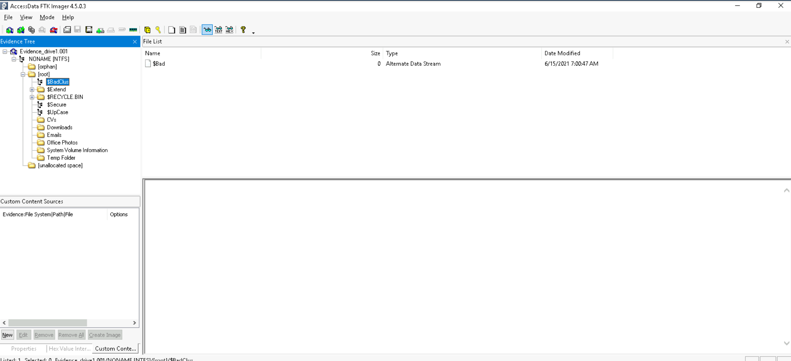
6. **Hash Code Generation**: I will generate hash codes (both **MD5** and **SHA-1**) for the files that I Idenfify to contain materials that could be of evidence in order to prosecute or exonorate the suspect.

---
## Examining Unallocated Space for Deleted Files

After opening the **Evidence_drive1.001** image as described above, I proceeded to examine the contents of the **[Unallocated Space]** folder. In the **Windows NTFS file system**, deleted files are often retained in unallocated space. This area is particularly valuable for forensic investigations because it may contain deleted files that have not been permanently removed from the drive. Deleted files often provide key insights into the behavior and intent of suspects, making unallocated space a critical zone for investigation.

In the case of **Beverly Gates**, the unallocated space on her hard drive appears to contain two notable files that warrant closer examination.

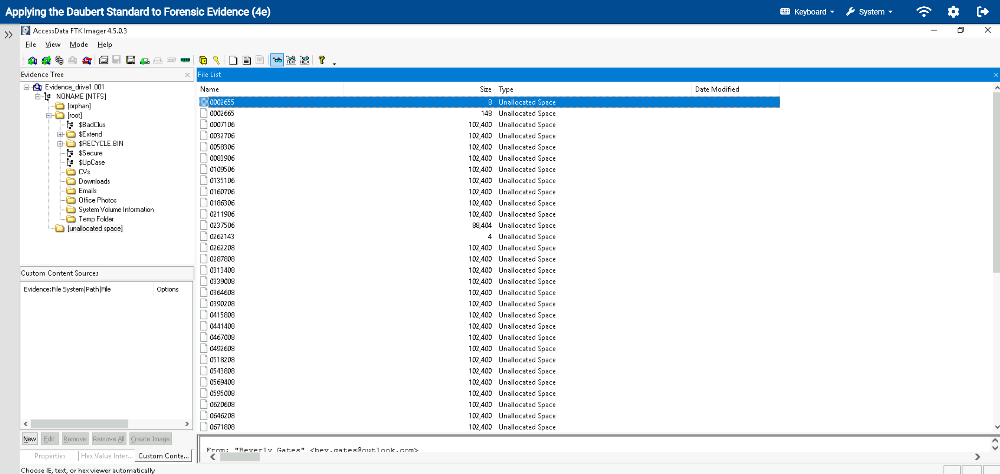

### File 1: 0002655 - Email Correspondence

The first significant file discovered in the unallocated space is **0002655**, which appears to be an email. Upon inspecting the contents, the email was sent by **Beverly Gates** using her personal email address **bev.gates@outlook.com**. The email was addressed to **ddan2024@gmail.com**, and two individuals were cc'ed:
- **Karen Jef** (Karen.jef@Intricate365.onmicrosoft.com)
- **Mr. Harris Malone** (mr.harrris@Intricate365.onmicrosoft.com)

#### Subject: 1:1 Meeting

The content of the email revolves around setting up recurring meetings for the first six months of **ddan2024@gmail.com's** work at **Intricate Solution**. After a thorough review, there is no incriminating evidence associated with this email. The conversation appears to be routine work communication related to scheduling meetings, which falls within Beverly's normal work responsibilities. As a result, this file is noted but will not serve as critical evidence in the case.
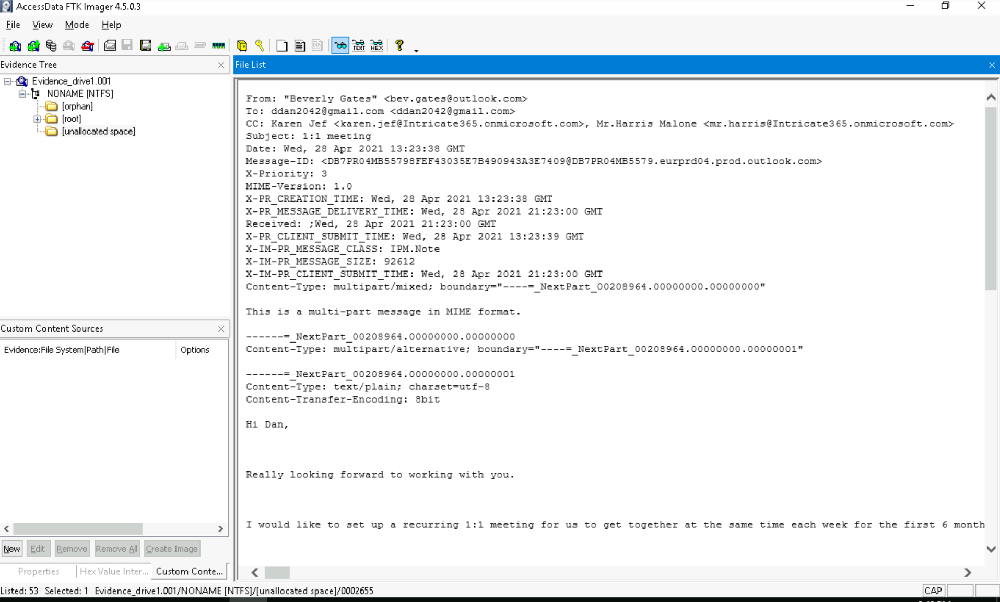
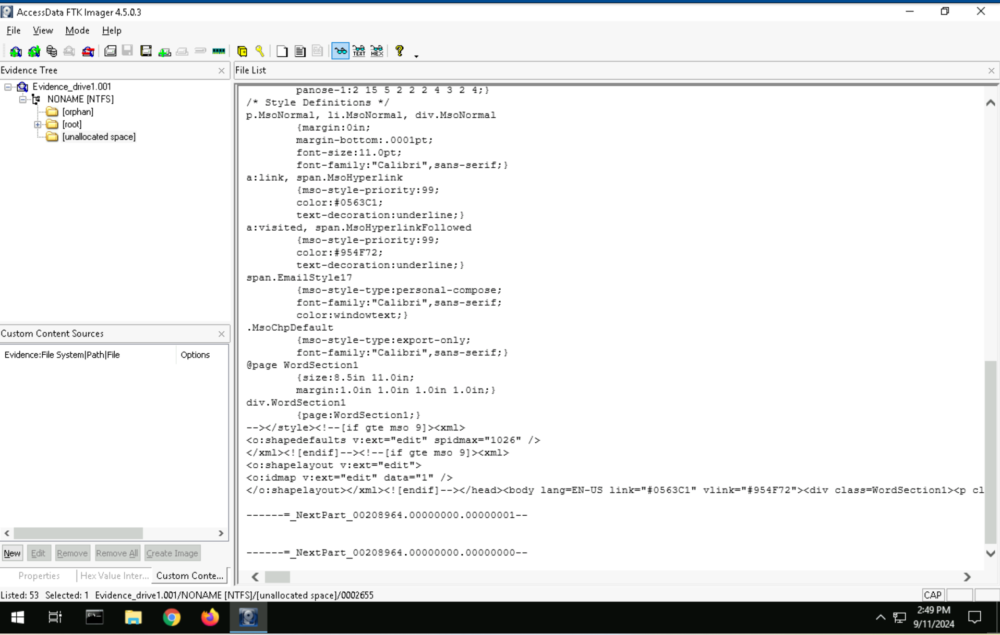

### File 2: 002665 - Incriminating Image

The second file, **002665**, is much more significant. This file appears to be an **image** and contains potentially incriminating content. Beverly Gates is suspected of involvement in **drug trafficking**, and the image in question seems to be a list of **drug dealers**, detailing:
- **What they sell**
- **Their phone numbers**

Given the nature of the investigation and the suspicions surrounding Beverly's involvement in illicit activities, this image could serve as a critical piece of evidence.

### Hashing and Exporting the Evidence

To preserve the integrity of this file and adhere to forensic best practices, I saved the image and immediately generated **hash values** (MD5 and SHA-1) for it. The hash values ensure that the file has not been altered since it was first extracted. The evidence was then exported to the **Evidence Folder**, and the **File Hash List** was generated and saved alongside it.
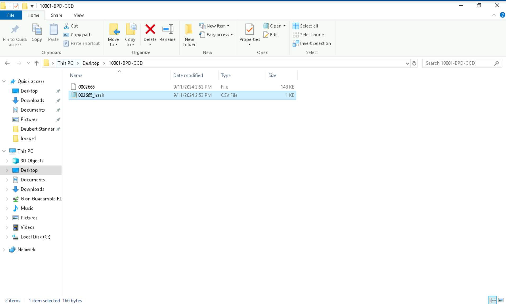
#### Exporting the File Hash List

The **Export File Hash List** function in FTK Imager allows us to create a **human-readable file** that contains the following critical fields:
- **MD5 Hash**: A cryptographic hash value that ensures data integrity.
- **SHA-1 Hash**: Another cryptographic hash used to verify the file's integrity.
- **Filename Location**: The location of the file within the imaged drive.

By maintaining these records, I ensure that as long as the hash values for the file remain unchanged, it can be verified as authentic and untampered evidence, regardless of the forensic tool used (whether FTK Imager, **Autopsy**, or **Paraben's E3**).

---

## Examining the $RECYCLE.BIN Folder for Deleted Files

The next folder I examined was the **$RECYCLE.BIN**. In **Windows systems**, the Recycle Bin holds files that users intend to delete. Although similar to unallocated space in that it can contain deleted files, the Recycle Bin differs in that its contents remain visible to the user and can be restored at any time. When users **empty the Recycle Bin**, the files are permanently deleted and moved to the **unallocated space**.

### How Deleted Files are Handled in the Recycle Bin

In **Windows 10**, when files are moved to the Recycle Bin, two separate files are created:
- The first file begins with **$I**, which contains the **original location** of the deleted file.
- The second file begins with **$R**, which is the **actual deleted file**.

In older versions of Windows, such as Windows 7 (excluding **Windows Vista**), deleted files were renamed using the **DC#.ext** format, where `#` is an incrementally increasing integer (e.g., **DC1**, **DC2**) and **ext** represents the file's original extension (e.g., **.txt** or **.exe**). The original locations of all deleted files were stored in a single file titled **INFO2**.

For forensic investigators, finding files in the Recycle Bin can be significant, as the act of deleting files might indicate that the computer owner intended to hide the contents. While deleting files is not necessarily criminal behavior, it becomes potentially suspicious when discovered during an investigation.

### Investigating the Recycle Bin: S-1-5-21-4050736057-2770387751-2791612479-1001 Subfolder

Inside the **$RECYCLE.BIN** folder, I navigated to a subfolder labeled **S-1-5-21-4050736057-2770387751-2791612479-1001**, where I identified two files that contain additional **incriminating evidence**.

#### File 1: $IOUMU8V.txt

The first file, **$IOUMU8V.txt**, contains the original file name and location of the deleted file, which is now stored as **$ROUMU8V.txt** in the Recycle Bin. The **$IOUMU8V.txt** file indicates that the original file was titled **MyRussianMafiaBuddies.txt** and was deleted from the 
**Downloads folder**.
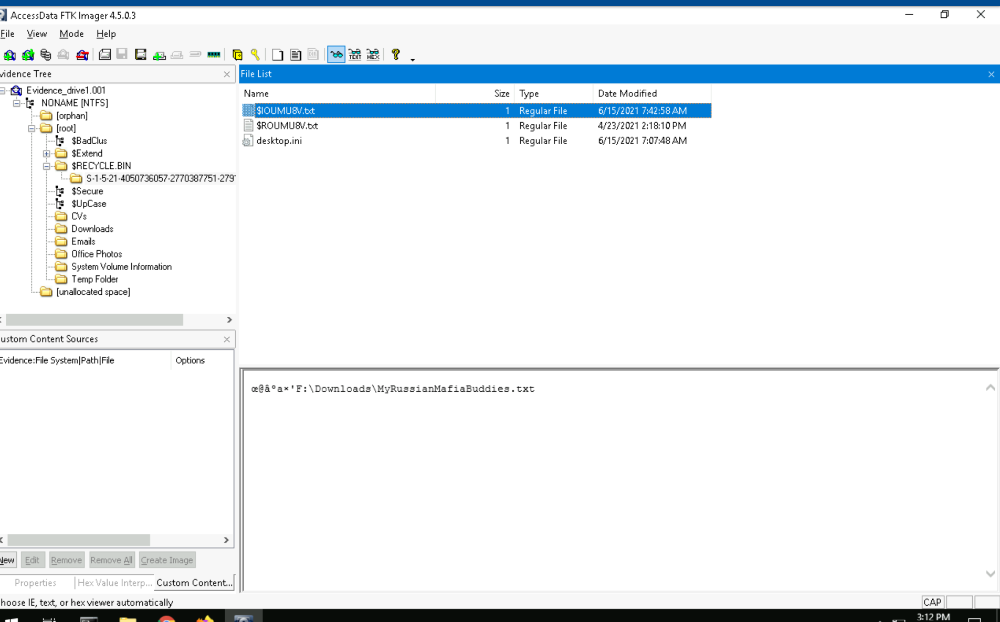
#### File 2: $ROUMU8V.txt

The second file, **$ROUMU8V.txt**, is the actual deleted file. As its name suggests, **MyRussianMafiaBuddies.txt** appears to contain a list of **Russian names and addresses**. Given that **Beverly Gates** is under investigation for **drug trafficking**, the contents of this file appear highly suspicious and relevant to the investigation. The name alone suggests possible connections to criminal networks, and the file will need to be analyzed thoroughly.
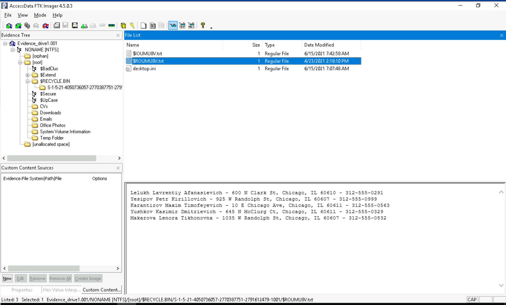

### Exporting and Hashing the Evidence

Since these two files are related, I selected both **$IOUMU8V.txt** and **$ROUMU8V.txt** and exported them together to the **Evidence Folder**. I then created their **hash values** (MD5 and SHA-1) to ensure the integrity of the files during the investigation. The **hash values** for the two files were saved in a file titled **RecycleBinEvidence_hash**.
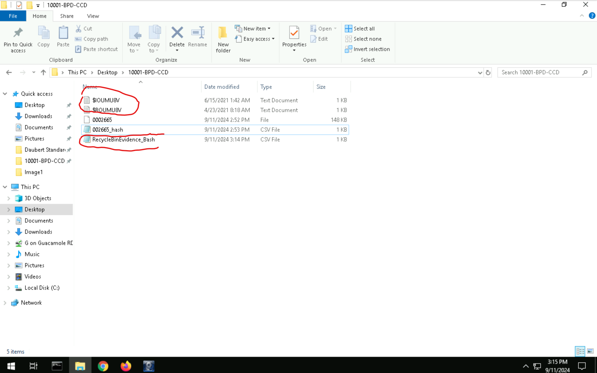

---

The contents of the **$RECYCLE.BIN** have provided valuable insight and crucial evidence in this case. The next steps in the investigation will involve further analysis of the files to establish links between **Beverly Gates** and any criminal activity, specifically her suspected involvement with **drug trafficking**.


## Searching for Copies of Deleted Files on Beverly Gates' Hard Drive

In my ongoing investigation, the next crucial step is to locate copies of the deleted files that may still exist on **Beverly Gates' hard drive**. Since **FTK Imager** lacks a search function, I’m carrying this out manually by exploring various folders. The disk image doesn’t contain much data, making the process relatively manageable, though in a real-world scenario, it would take much longer.

I’ve already identified two critical files during my previous review:
1. **MyRussianMafiaBuddies.txt** – Found in the **Recycle Bin**.
2. **Nice Guys.png** – Discovered in the **Unallocated Space**.

I began by focusing on the **Temp Folder**, which stood out due to its unusual name compared to the more typical folders like **CVs, Downloads, Emails, Office Photos, and System Volume Information**.

### Navigating to the Temp Folder

Upon opening the **Temp Folder** in the **File List** pane, there they were—**MyRussianMafiaBuddies.txt** and an image file titled **Nice Guys.png**. This was a huge find, and things were starting to fall into place.

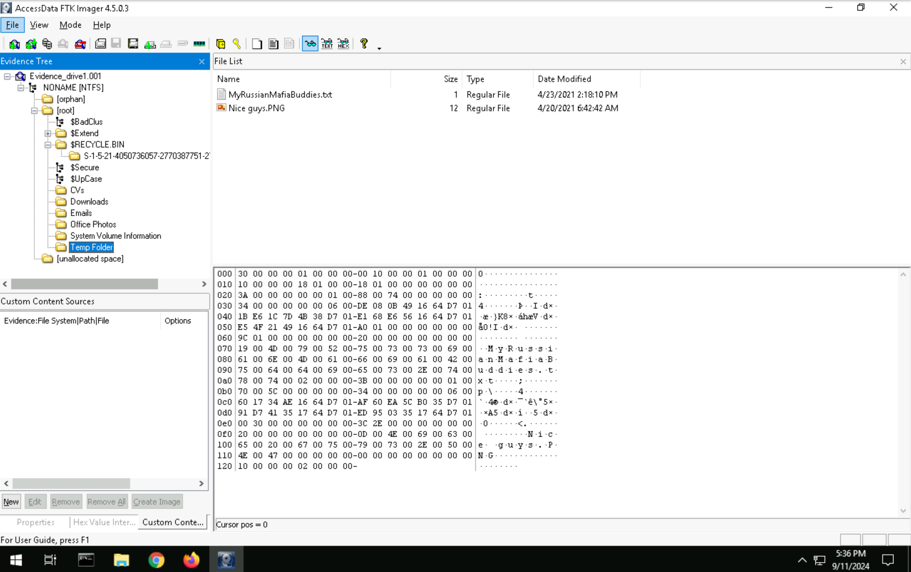
### File Review and Verification

After reviewing each file in detail, I was able to confirm that they **exactly match** the files I had found earlier in the **Unallocated Space** and **Recycle Bin**.

- **Nice Guys.png** matches the file discovered in the **Unallocated Space**.
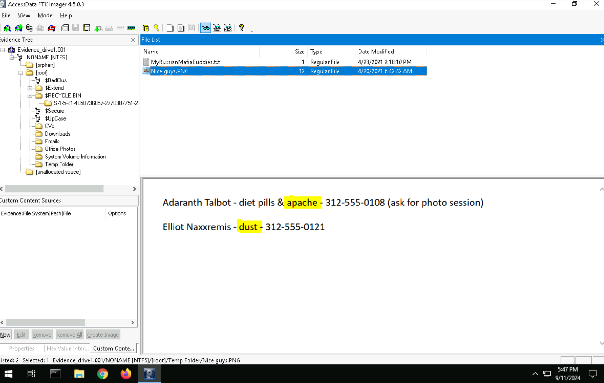
- **MyRussianMafiaBuddies.txt** matches the file found in the **Recycle Bin**.
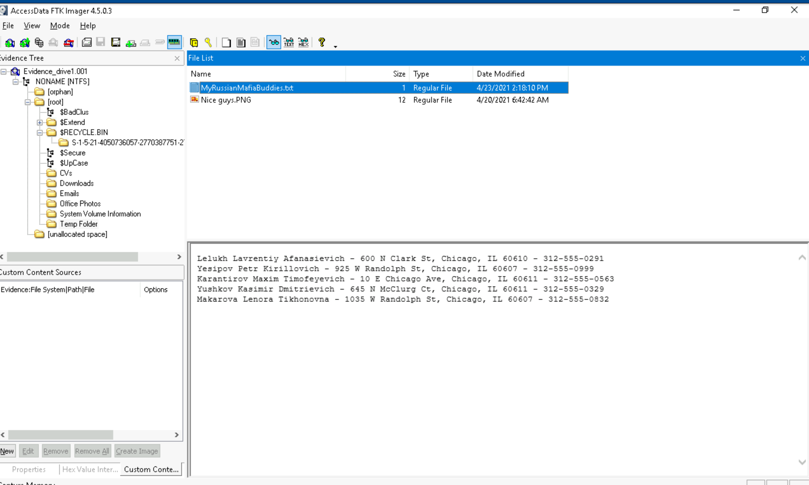
### Exporting Files as Evidence

I proceeded with exporting both files to my **Evidence Folder**, ensuring that they are preserved for further analysis and legal proceedings. To maintain the integrity of the files, I generated their corresponding hash values and saved them as follows:

- **MyRussianMafiaBuddies.txt** was exported, and its hash file was saved as **MyRussianMafiaBuddies_hash**.
- **Nice Guys.png** was also exported, and its hash file was saved as **NiceGuys_hash**.

By doing this, I ensured that these crucial pieces of evidence are not tampered with and remain intact as I continue to build the case.

 ## Images of Hashes Generated for the Evidence Obtained
1. **Recycle Bin Evidence Hash**
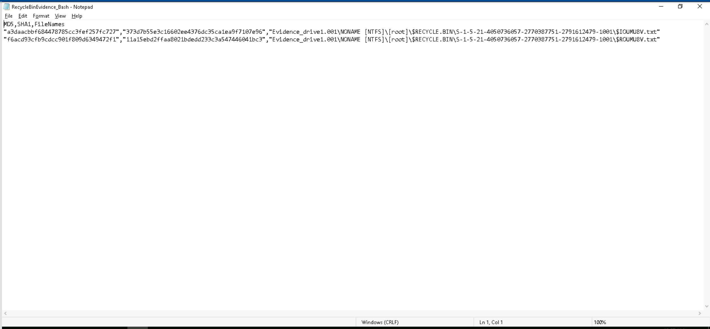
```hash
MD5,SHA1,FileNames
"a3daacbbf68447875cc3fef257cf727","373d7b55e3c16602ee4376dc35ca1ea94f7107e96","Evidence_drive1.001\NONAME [NTFS]\[root]\$RECYCLE.BIN\S-1-5-21-4050736057-2770387751-2791612479-1001\$IOUMU8V.txt"
"f6acd93cfb9cdcc901f809d6349472f1","11a15ebd2ffaa8021bded233c3a54744604bc3","Evidence_drive1.001\NONAME [NTFS]\[root]\$RECYCLE.BIN\S-1-5-21-4050736057-2770387751-2791612479-1001\$ROUMU8V.txt"

```

2. **Nice Guys Has File**
 
 ```hash
 MD5,SHA1,FileNames
"0067f03ada8c4d43245f0e9ca663bb36","d3419ee4b32bacc22452d3a7575d544d99a15a78","Evidence_drive1.001\NONAME [NTFS]\[root]\Temp Folder\Nice guys.PNG"

 
 ```

 3. **My Russian Biddies Evidence Hash**
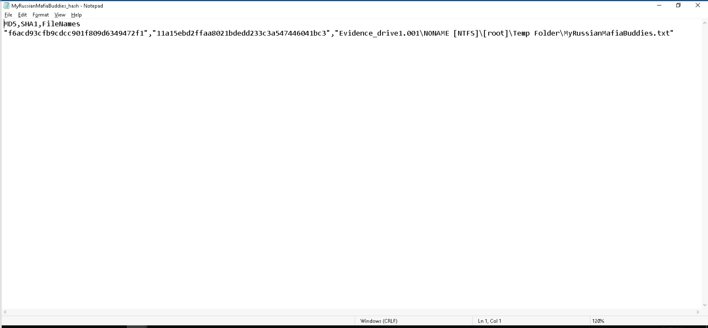

 ```hash
MD5,SHA1,FileNames
"f6acd93cfb9cdc901f809d6349472f1","11a15ebd2ffaa8021bdedd233c3a547446041bc3","Evidence_drive1.001\NONAME [NTFS]\[root]\Temp Folder\MyRussianMafiaBuddies.txt"


 
 ```
4. **File 002665 Evidence Hash** 
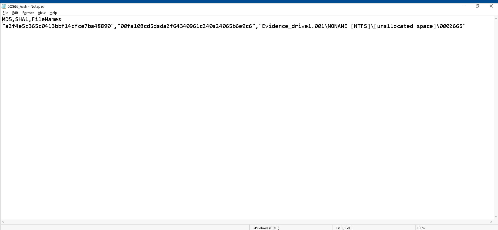
 ```hash
MD5, SHA1, FileNames

"a2f4e5c365c0413bbf14cfce7ba48890", "00fa108cd5dada2f64340961c240a24065b6e9c6", "Evidence_drive1.001 NONAME [NTFS][unallocated space]\0002665"


 
 ```

---
## Verifying Hash Codes with Paraben’s E3

In this part of the investigation, I’m shifting gears to another powerful forensic tool—**Paraben's Electronic Evidence Examiner (E3)**—to verify the integrity of the evidence I previously gathered. Hash verification is an essential step in digital forensics to ensure that the files I acquired haven’t been altered or tampered with between different stages of the investigation.

### Why Use E3 for Hash Verification?

E3 is a versatile tool that’s widely used in real-world forensic investigations. It offers a comprehensive platform for handling various types of evidence, from **smartphone data** and **cloud storage** to **IoT devices** and **email analysis**. The flexibility and power of E3 make it ideal for forensic analysts like myself who need to process complex datasets while ensuring the integrity of the evidence collected.

### The Importance of Hash Verification

In real investigations, it’s common for the **first responder**—who initially acquires the evidence—and the **forensic analyst**—who later processes it—to be different people. Weeks, or even months, may pass between the initial acquisition and the investigation. For example, the first responder may use **FTK Imager** to create forensic images and generate hash values during acquisition. Later, when the forensic analyst works on the evidence, they may use a different tool such as **E3** for the analysis.

This is where hash verification becomes critical. I need to ensure that the **MD5 hashes** generated during the initial acquisition match the ones I generate now with **E3**. This guarantees that the files remain unchanged and that the chain of custody has not been broken.

### Verifying Hashes in E3: Noble Worlanyo Antwi BG Case File

After launching **Paraben's E3 application**, I began by creating a new case under the name: **Noble Worlanyo Antwi BG Case File**. I then loaded the **Evidence Image** previously acquired using FTK Imager: **Evidence_drive1.001**. This step displayed all folders and subfolders within the evidence image, allowing for further investigation.
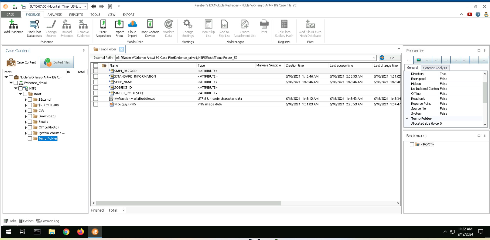

#### Navigating the Temp Folder

To maintain consistency with the analysis done in **FTK Imager**, I navigated to the **Temp Folder** within the evidence image. Previously, in FTK Imager, this folder contained two key files of interest: 
- **MyRussianMafiaBuddies.txt**, which I initially recovered from the **Recycle Bin**, 
- **Nice Guys.png**, which I found in **Unallocated Space**.

These files were flagged for further examination due to their relevance to the investigation. 

#### Running Content Analysis

Right-clicking the **Temp Folder**, I initiated a **Content Analysis** in E3. This analysis provided detailed insight into the folder's contents, including generating hash values to compare with the hashes obtained earlier in **FTK Imager**.

Below is a screenshot showing the Content Analyzer running with its **default settings**.
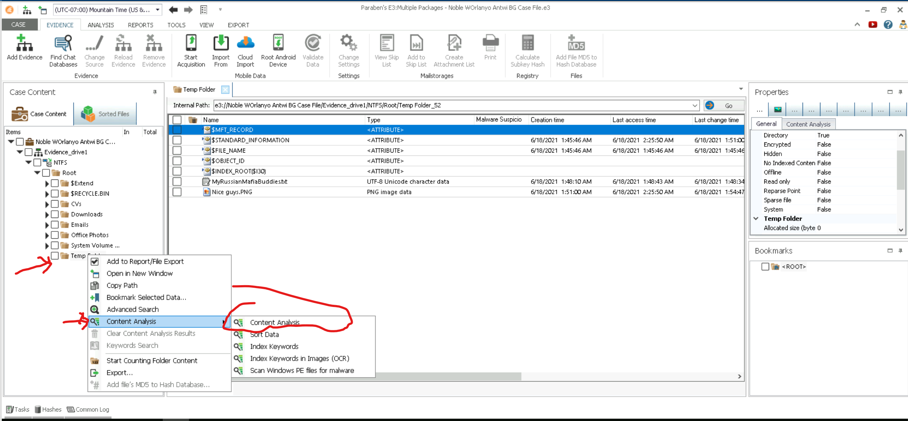
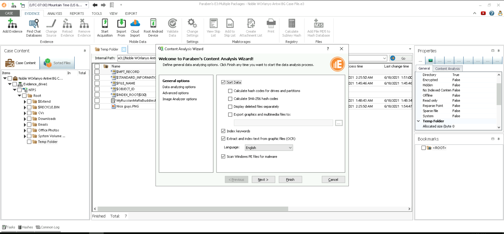

#### Retrieving Hashes for Files

After completing the content analysis successfully (as shown in the attached completion image), I moved on to verify the **MD5** and **SHA-1** hashes for the specific files.
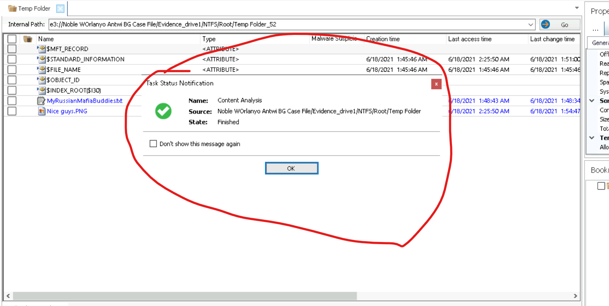

1. **For MyRussianMafiaBuddies.txt**:
   - In the **center pane**, I selected the file, and the **Properties pane** displayed the file's metadata, including its hash values.
   - The **MD5** value generated in **E3** was:  
     **CDC901F809D6349472F1**
     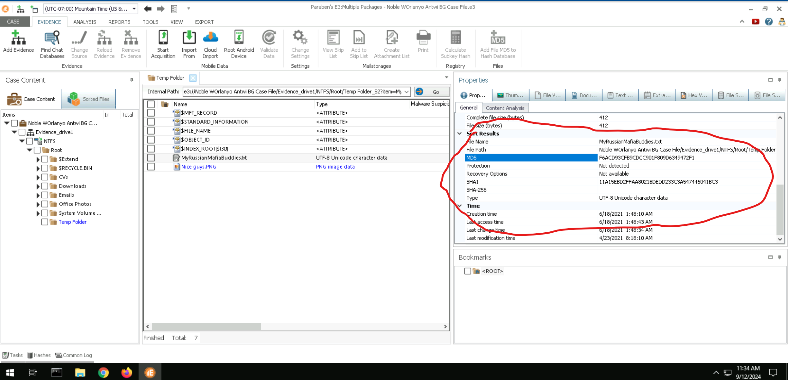
   
2. **For Nice Guys.png**:
   - I repeated the process, selecting **Nice Guys.png** and reviewing the properties.
   - The **MD5** value generated in **E3** was:  
     **0067F03ADA8C4D43245F0E9CA663BB36**
     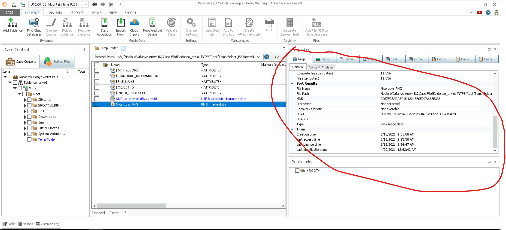

#### Comparing Hash Values

After obtaining the hash values from **E3**, I compared them with the ones generated earlier in **FTK Imager**. Notably, the only difference between the two sets of values was the **capitalization**—E3 produced hashes in uppercase, whereas FTK Imager left them in lowercase. Aside from this, the actual hash values remained identical, confirming the integrity of the files.

- **FTK Imager**:  
   - **MyRussianMafiaBuddies.txt**: `cdc901f809d6349472f1`  
   - **Nice Guys.png**: `0067f03ada8c4d43245f0e9ca663bb36`

- **E3**:  
   - **MyRussianMafiaBuddies.txt**: **CDC901F809D6349472F1**  
   - **Nice Guys.png**: **0067F03ADA8C4D43245F0E9CA663BB36**

#### Conclusion

Based on the comparison of the hash values, I can confidently conclude that the files have remained **unaltered** throughout the forensic investigation process. Despite the difference in capitalization between the tools, the actual MD5 hash values are identical, ensuring the evidence's integrity. This consistency confirms that the files in question are authentic and can be relied upon in further forensic analysis.


## Further Analysis of the Email Folder in FTK Imager

## Case Overview
As part of the ongoing investigation into **Beverly Gates**, I conducted a more in-depth search of the **Emails** folder within her seized drive image. The objective was to uncover furhter incriminating communications, particularly involving coded language for illegal activities. My supervisor suggested that Beverly may have exchanged emails with her criminal partners, so I focused on analyzing these communications.

Upon reviewing the email files in this folder, I identified one suspicious email titled **"Re: Stuff Purchase Request."**

## Content of Suspicious Email

Upon opening the email, I found a conversation between **Mrs. Maxinoff** and **Elliote Jeffrey**. The conversation contained coded language referring to "stardust," which, based on my understanding of the case, is likely a euphemism for illegal substances (possibly drugs).

Jeffrey was attempting to purchase "stardust," and Mrs. Maxinoff appeared to be facilitating the deal. This email exchange provided further evidence of Beverly Gates' involvement in illegal activities.

---

## Evidence Extraction and Hash Generation

To maintain the integrity of the evidence, I followed standard forensic procedures and exported the suspicious email for further examination. The email was saved with the following details:

- **File Name**: `Re_ Staff purchase request.eml`
- **File Location**: Evidence Folder

A corresponding hash file, titled **StardustEmailConversation_hash**, was also created and saved in the evidence folder. This hash code can be used for verification purposes in future analysis and to demonstrate that the file has not been altered during the investigation.
Kindly find the video and image attachement below for evidence of work done.
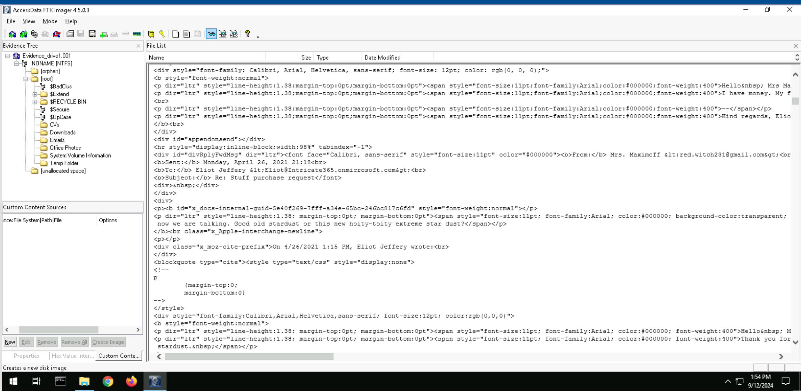

<video controls src="vid/1StardustEmailContent.mp4" title="Stardust Email Chain Evidence"></video>

## Analysis of Email Manipulation and Hash Validation

During the investigation of the evidence image, I identified a suspicious email titled **"Re: Stuff Purchase Request"** that raised concerns regarding potential illegal activities. The email, exchanged between Mrs. Maxinoff and Elliot Jeffrey, contained coded language such as references to "stardust," which I strongly suspected to be linked to illicit transactions.

To delve deeper into the investigation, I opted to manipulate the content of this email file to demonstrate how modifications to digital evidence can be detected. Using Notepad, I carefully edited portions of the email, removing specific content to create a subtle alteration. Once these changes were made, I re-imported the entire evidence folder, **10001-BPD-CCD**, back into FTK Imager for analysis.
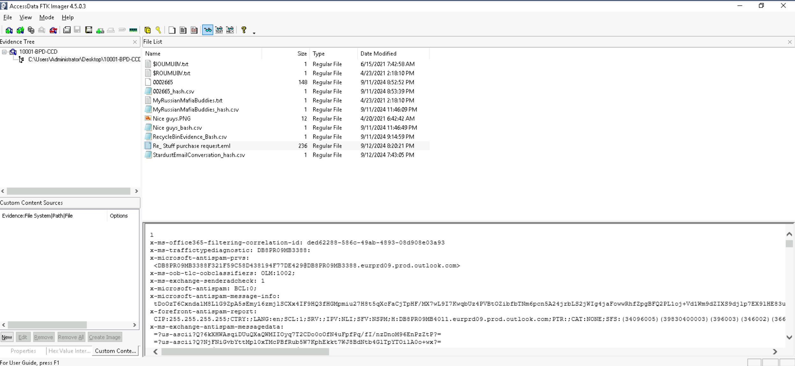

Upon re-examining the edited email, I generated new hash values to compare against the original. The results were as expected: the alterations caused a complete deviation in the hash codes. 

The **original email** file produced the following hash values:
- **MD5**: `57581DE091C9C9C01F259107F2BC2437`
- **SHA1**: `3B8DE9306DEBC9424B09FFC640C321DDBB9B096E`

In contrast, the **edited email** resulted in:
- **MD5**: `DDAC9EA4FBA81B50E39E366531873F2D`
- **SHA1**: `264B75F6F7CA08109DE6E7856A4D544FE8519D36`

The distinct differences in the MD5 and SHA1 values confirm that even minor modifications to the evidence file altered its cryptographic hash, thus demonstrating the efficacy of hash values in preserving the integrity of digital evidence. This variance underscores the importance of using hashing as a robust method to ensure that evidence remains unaltered throughout the investigative process.

## Verifying Hash Codes with Autopsy

In the next phase of the investigation, I leveraged **Autopsy**, a comprehensive digital forensics tool designed for analyzing drive images. Autopsy serves as a graphical interface for **The Sleuth Kit**, an open-source suite of command-line utilities widely used in digital forensics. What makes Autopsy particularly versatile is its plug-in architecture, allowing for extended functionality with custom or community-developed modules.
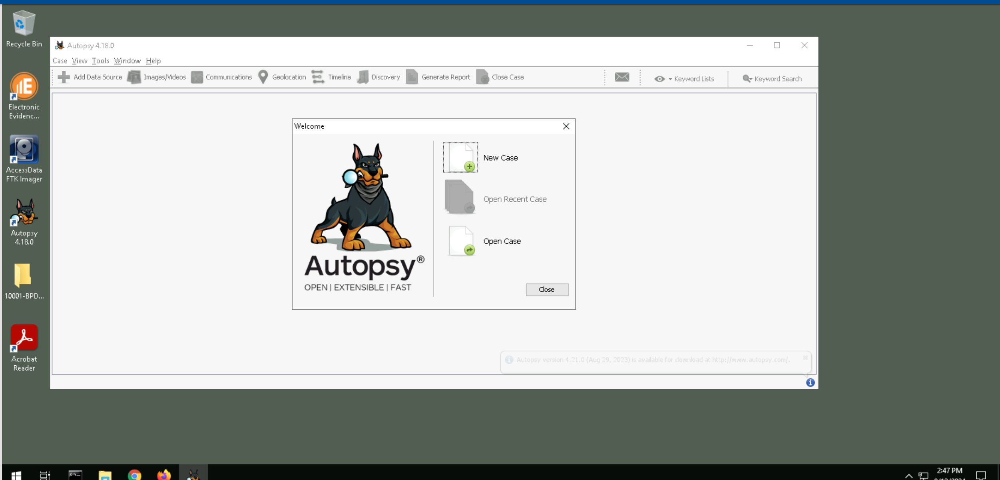

Given its ease of use and its extensive analytical capabilities, Autopsy was an ideal choice to verify the hash values produced in the initial stages of the investigation using FTK Imager.

I proceeded by creating a new case titled **BG_Evidence**, which was saved in the **Documents** directory of the C drive. For the image analysis, I employed the same drive image used in FTK Imager, **Evidence_drive1.001**, and retained the default settings throughout the import process.

Upon successful data upload, I navigated to the **Email** folder under the **Evidence Drive** in the data source tree view. 
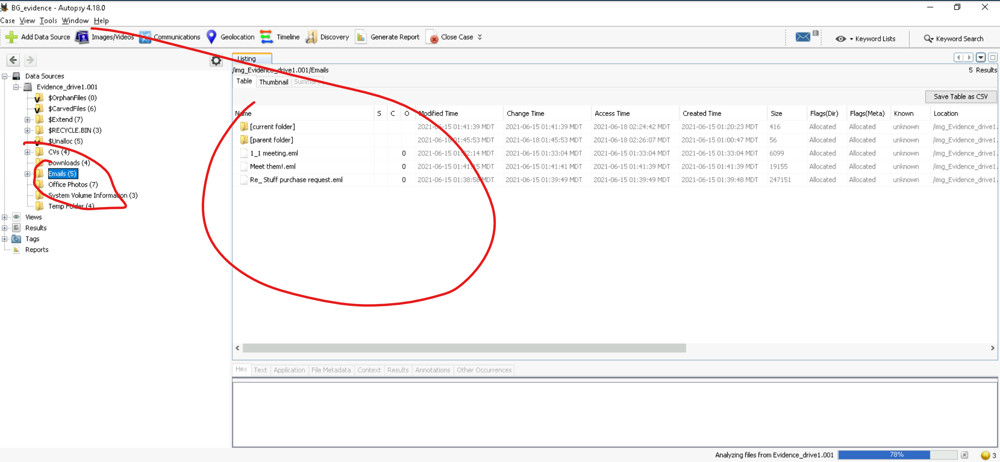

The email in question, **Re_Stuff purchase request.eml**, was then opened, and I selected the **File Metadata** tab to review its properties. Here, the **MD5 hash** for the file was displayed as:

- **MD5**: `57581DE091C9C9C01F259107F2BC2437`

This hash value was consistent with the one previously generated in FTK Imager. Comparing the results from both tools—FTK Imager and Autopsy—I can confidently conclude that the MD5 hash value for the email file remained identical across both platforms. This validation reinforces the integrity of the digital evidence and the reliability of cryptographic hashing for ensuring that the data remains unaltered.
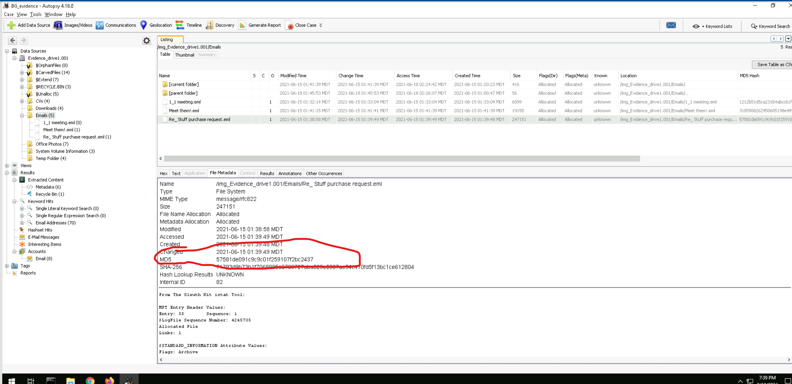

### Conclusion

The consistency of the **MD5 hash value** across both FTK Imager and Autopsy, `57581DE091C9C9C01F259107F2BC2437`, confirms that no alterations have been made to the **Re_Stuff purchase request.eml** file during the analysis process. This further strengthens the confidence in the forensic methodologies employed, as both tools provided identical results, verifying the authenticity and integrity of the digital evidence. The use of hashing proves crucial in maintaining the chain of custody, ensuring that the data examined during the investigation is the same as when it was initially collected.

## Hash Code Verification with FTK Imager Command Line

In continuing the forensic analysis, I decided to delve deeper into command-line operations with **FTK Imager**. Command-line tools provide forensic professionals with more flexibility and automation capabilities during investigations. To extend my toolkit and enhance my skills, I researched the command-line version of **FTK Imager** to verify the integrity of the drive image, **Evidence_drive1.001**, which had been at the center of this investigation.

To enable command-line usage, I first copied the installation directory of FTK Imager (`C:\Program Files\AccessData\FTK Imager\cmd\`) and added it to the system's PATH environment variable. This allowed me to access FTK Imager commands from any location in the command prompt.
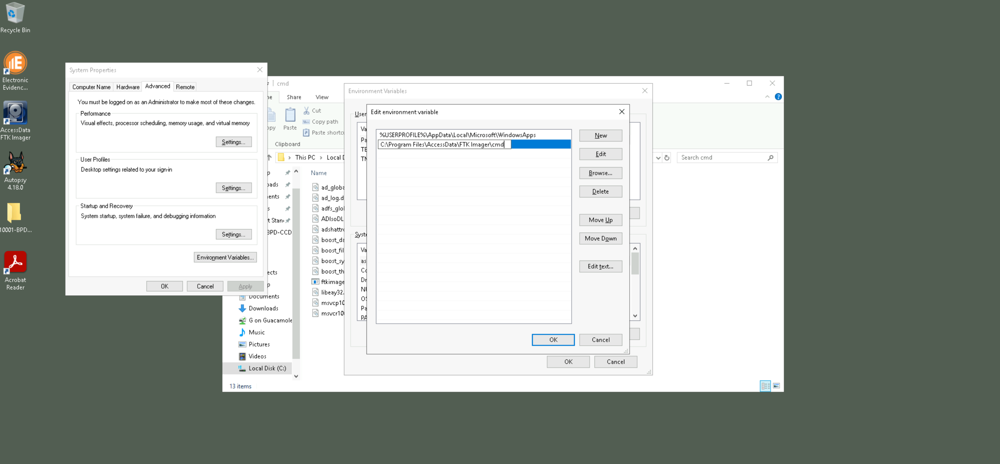

After some research, I identified the appropriate command to generate both **SHA1** and **MD5** hash codes for the image. The command used was:

```bash
ftkimager --verify Evidence_drive1.001
```

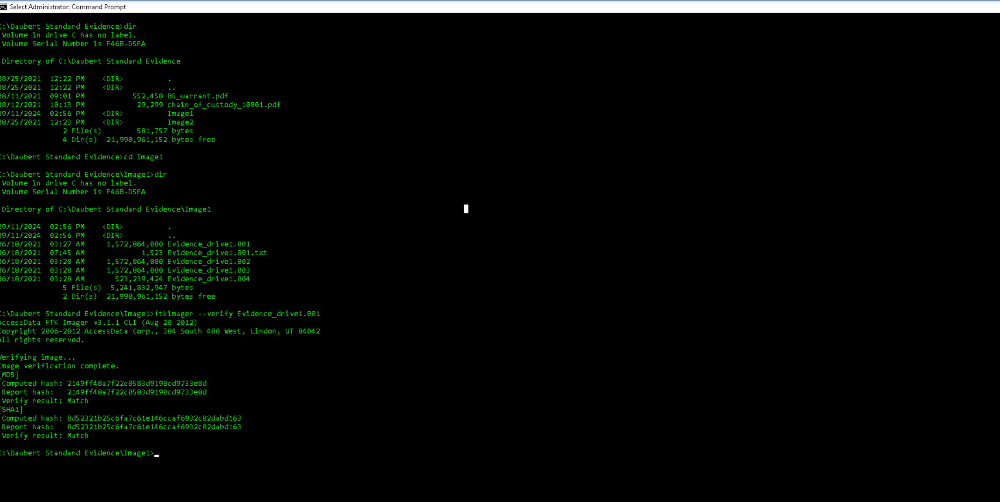


========================================================================
# Executive Summary

This forensic investigation focused on analyzing a digital image file associated with an alleged drug trafficking case. The primary goal was to assess the integrity of the evidence collected, ensure that no alterations had been made, and verify the file's authenticity. Using industry-standard forensic tools such as **FTK Imager** and **Autopsy**, the investigation included the extraction of key evidence, hash code verification for files suspected of containing illicit activity, and validation of the integrity of the original drive image. The process successfully demonstrated that the evidence remained intact throughout the investigation, thus preserving the chain of custody and ensuring reliable results for further legal examination.

---

# Forensic Investigation Report

### Investigation Overview

This investigation centered on a forensic analysis of a seized drive image, **Evidence_drive1.001**, believed to contain incriminating evidence related to drug trafficking. The image was examined using various forensic tools, such as **FTK Imager** and **Autopsy**, to extract, verify, and preserve critical evidence. During the investigation, particular emphasis was placed on verifying hash codes to confirm the integrity of files extracted from the drive.

## Conclusion

In conclusion, the forensic analysis of **Evidence_drive1.001** successfully confirmed the integrity, authenticity, and reliability of the digital evidence collected throughout the investigation. The hash values generated by **FTK Imager**, **Autopsy**, and **E3** were consistent, verifying that no alterations occurred during the imaging process. This thorough validation ensured the evidence was preserved in its original state, reinforcing its admissibility in court.

Upon closer examination of the suspicious email and other relevant files cross-checked across the forensic tools, substantial evidence emerged to support the involvement of **Beverly** in drug trafficking activities. The recovered email exchanges, alongside other incriminating documents, provided critical insights into her illegal activities, strengthening the case against her. The application of cryptographic hashing techniques and advanced forensic tools has helped maintain the integrity of the digital evidence, ensuring that the findings can withstand scrutiny in legal proceedings.

Thus, based on the digital forensics conducted, there is conclusive evidence to link **Beverly** to drug trafficking, supporting the initial hypothesis of her involvement.


## Disclaimer

It is important to note that the scenario presented in this lab report is a simulated exercise based on a hypothetical case provided in the lab titled **"Applying the Daubert Standard to Forensic Evidence"** from the book *Digital Forensics, Investigation, and Response, 4th Edition* by Chuck Easttom. The details, including the investigation, findings, and conclusions, are constructed for educational purposes and do not reflect real-world events or actual individuals. 

The objective of this lab was to apply forensic methodologies and tools in a controlled environment to understand and practice the principles of digital forensics and evidence integrity as per the Daubert standard. All evidence, scenarios, and conclusions discussed in this report are fictional and are intended to demonstrate the application of forensic techniques rather than to assert factual claims about real-world entities.

This disclaimer serves to clarify that the content of this report is based on a structured educational exercise and is not intended as an assertion of actual events or personal intellectual property.


